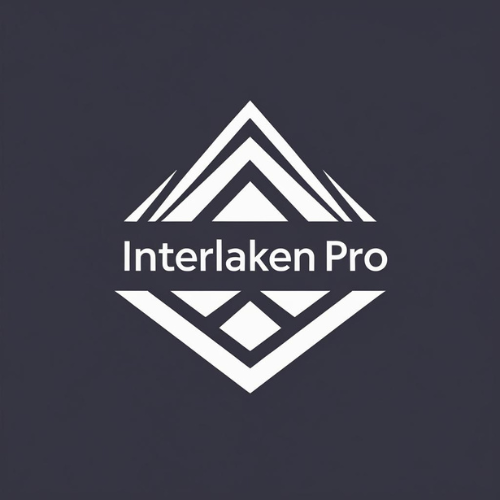
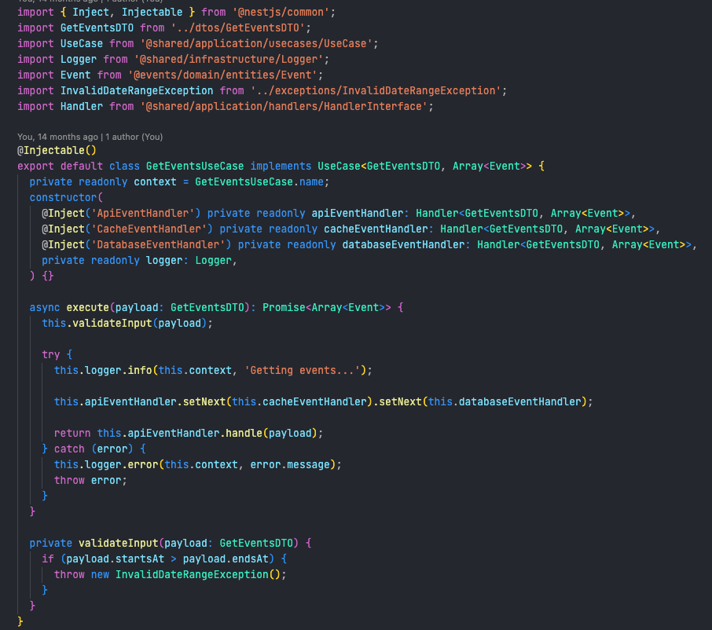
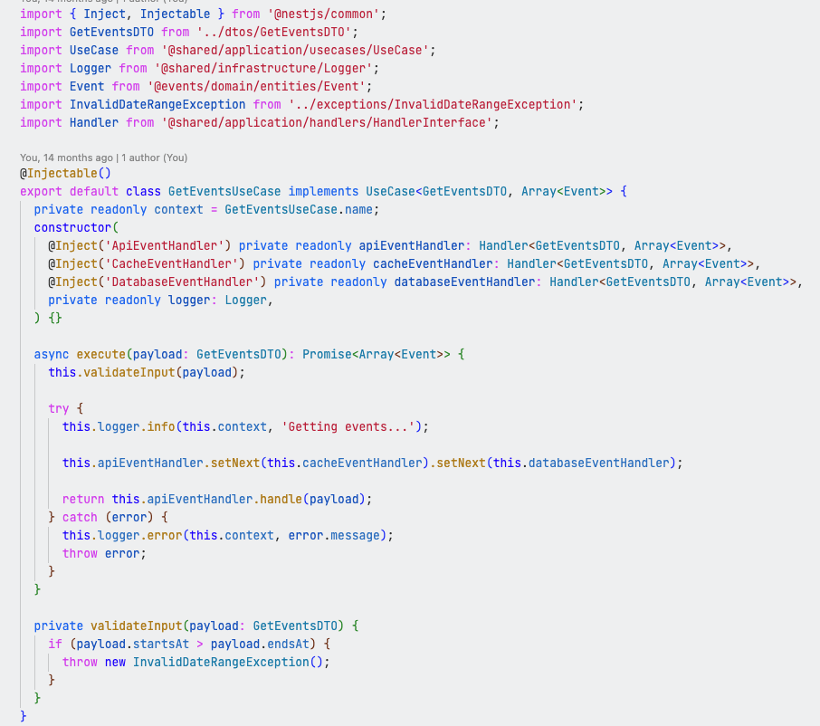

# Interlaken Pro

  

A professional dark and light theme pair for Visual Studio Code with excellent syntax highlighting across multiple programming languages. Interlaken Pro combines the elegance of Swiss design principles with modern developer needs.

## Features

- **Dual Theme Support**: Both dark and light variants
- **Excellent Syntax Highlighting**: Optimized colors for JavaScript, TypeScript, Go, Python, C++, and more
- **Consistent Color Scheme**: Well-organized color hierarchy for different code elements
- **Professional Design**: Clean and modern appearance following VS Code design principles

## Themes Included

### Interlaken Pro Dark
A sophisticated dark theme inspired by One Dark Pro Flat, featuring excellent contrast and readability with carefully selected colors that reduce eye strain during long coding sessions.

### Interlaken Pro Light  
A refined light theme with a warm F0F1F2 background, following modern design principles with enhanced colors and superior contrast for daylight development.

## Language Support

- JavaScript & TypeScript
- Go
- Python
- C & C++
- Shell/Bash
- HTML & CSS
- JSON & Markdown
- And many more...

## Color Philosophy

The theme uses a consistent color hierarchy:
- **Blue (#0000FF)**: Declaration keywords (func, type, class, const)
- **Purple (#D946EF)**: Control flow keywords (if, return, for, while)
- **Orange (#C41E3A)**: Strings and literals
- **Green (#22863A)**: Comments
- **Gold (#B8860B)**: Functions and methods

## Installation

### From VS Code Marketplace
1. Open Visual Studio Code
2. Go to Extensions (Ctrl+Shift+X / Cmd+Shift+X)
3. Search for "Interlaken Pro"
4. Click Install
5. Select your preferred theme: `Interlaken Pro Dark` or `Interlaken Pro Light`

### Manual Installation
1. Download the latest `.vsix` file from [Releases](https://github.com/abxlcrz/polaris-dark-pro/releases)
2. Open VS Code and run `Extensions: Install from VSIX...` from the Command Palette
3. Select the downloaded file
4. Choose your preferred theme variant

## Repository

[GitHub Repository](https://github.com/abxlcrz/polaris-dark-pro)

## License

MIT License

## Screenshots

### Interlaken Pro Dark

### Interlaken Pro Light

## Contributing

Found a bug or have a suggestion? Please open an issue on our [GitHub repository](https://github.com/abxlcrz/polaris-dark-pro).

## Changelog

See [CHANGELOG.md](CHANGELOG.md) for detailed version history.

---

**Enjoy coding with Interlaken Pro!** 🏔️
